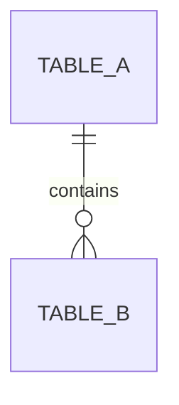
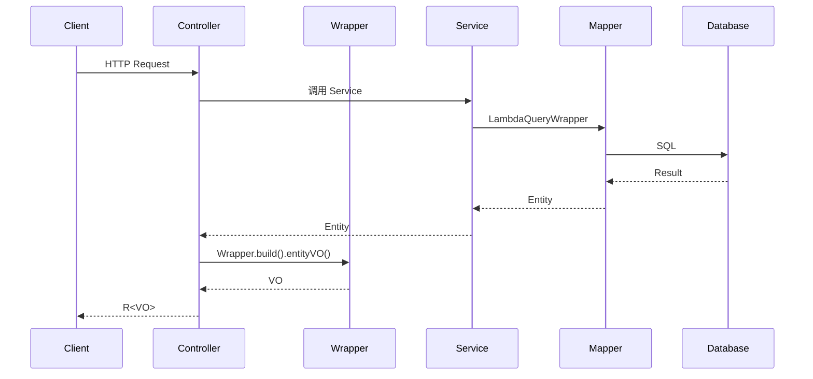

# Blade Spec — 文档模板

本文件包含工作流中所有文档的标准模板。生成文档时必须遵循这些结构，但具体内容应根据项目的技术栈和架构风格灵活调整。

以下示例以 BladeX 体系（Spring Boot / Spring Cloud）项目为基准，涵盖 Boot 单体和 Cloud 微服务两种工程形态。

---

## spec.json

Spec 元数据文件，记录状态和基本信息。每次状态变更必须立即更新此文件。

```json
{
  "version": "1.0.0",
  "name": "chat-management",
  "description": "多模型对话管理功能",
  "requirement": "用户原始需求的完整描述...",
  "auto_mode": false,
  "phase": "requirements",
  "created_at": "2024-03-28T10:00:00Z",
  "updated_at": "2024-03-28T10:00:00Z",
  "current_task": null,
  "phases": {
    "requirements": { "status": "pending", "approved_at": null },
    "design": { "status": "pending", "approved_at": null },
    "tasks": { "status": "pending", "approved_at": null },
    "execution": { "status": "pending", "started_at": null, "completed_at": null }
  }
}
```

**字段说明：**

| 字段 | 说明 |
|---|---|
| name | Spec 英文短名，与文件夹名一致 |
| description | 一句话中文描述 |
| requirement | 用户原始需求文本（完整保留） |
| auto_mode | 是否为自动模式（`true` 时跳过阶段间审批，全流程自动执行） |
| phase | 当前阶段：`requirements` \| `design` \| `tasks` \| `executing` \| `completed` |
| current_task | 当前执行中的任务 ID，无则为 null |
| phases.*.status | `pending` \| `in_progress` \| `approved` \| `completed` |

**更新时机：**

| 事件 | 更新操作 |
|---|---|
| 开始生成文档 | phases.{phase}.status = `in_progress` |
| 用户审批通过 | phases.{phase}.status = `approved`，写入 approved_at |
| 进入下一阶段 | 顶层 phase 字段更新 |
| 开始执行任务 | current_task = 任务 ID |
| 任务完成 | current_task = null，updated_at 刷新 |
| 全部完成 | phase = `completed`，execution.completed_at 写入 |

---

## requirements.md

````markdown
# {Spec 中文名} — 需求文档

> Spec: {name}
> 创建时间: {timestamp}
> 状态: 待审批

## 需求原文

> {对用户原始需求进行文案润色后的版本。保留用户表达的所有意图和功能点，仅优化措辞使其更清晰、更专业。严禁添加用户未提及的功能或需求。}

## 需求概述

{一段话描述功能是什么、解决什么问题、为什么需要。简明扼要，2-3 句话。}

## 用户故事

### R-001: {故事标题}

**作为** {角色}，**我希望** {功能描述}，**以便** {业务价值}。

**验收标准：**

- **AC-001.1**: GIVEN {前置条件} WHEN {操作} THEN {预期结果}
- **AC-001.2**: GIVEN {前置条件} WHEN {操作} THEN {预期结果}
- **AC-001.3**: GIVEN {边界/异常条件} WHEN {操作} THEN {预期结果}

### R-002: {故事标题}

**作为** {角色}，**我希望** {功能描述}，**以便** {业务价值}。

**验收标准：**

- **AC-002.1**: GIVEN ... WHEN ... THEN ...

## 非功能需求

- **性能**: {如有性能要求，如"单次推理响应 < 3s"}
- **安全**: {如有安全要求，如"API Key 不可明文存储"}

## 范围外事项

- {明确不在本次范围内的功能点}
- {可能被误认为包含但实际不做的}

## 约束与假设

- {技术约束：如依赖特定框架版本、API 限流等}
- {业务假设：如数据量级、并发量}
- {前置依赖：如需要某模块先就绪}

## 术语表

| 术语 | 定义 |
|---|---|
| {术语} | {在本 Spec 上下文中的含义} |
````

**编写要点：**

- 「需求原文」是对用户输入的润色版本，目的是让文档读者快速理解原始意图。润色仅限于措辞优化（使表达更清晰、更专业、更完整），严禁增删用户未提及的功能点或业务需求。如果用户的原始表述已经足够清晰，保持原文即可
- 每个用户故事至少 2 条验收标准，其中至少 1 条覆盖边界/异常场景
- 验收标准使用 GIVEN/WHEN/THEN 格式，确保可量化验证
- 需求编号从 R-001 递增，验收标准编号为 AC-{需求号}.{序号}
- 术语表只列出有歧义或项目特有的术语，无则省略该节
- 范围外事项帮助约束后续设计，避免范围蔓延

---

## design.md

````markdown
# {Spec 中文名} — 技术设计

> Spec: {name}
> 创建时间: {timestamp}
> 状态: 待审批
> 关联需求: requirements.md

## 架构概述

{描述新功能在系统中的位置、与现有模块的关系。1-2 段话。}

## 模块设计

### 包结构

{根据项目架构展示模块结构。以下为 BladeX 体系示例：}

**Boot 单体工程**（以 BladeX-Boot 为参考）：

```
src/main/java/org/springblade/modules/{module}/
├── controller/
│   └── {Name}Controller.java          # extends BladeController
├── service/
│   ├── I{Name}Service.java            # extends BaseService<Entity>
│   └── impl/
│       └── {Name}ServiceImpl.java     # extends BaseServiceImpl<Mapper, Entity>
├── mapper/
│   └── {Name}Mapper.java
├── wrapper/
│   └── {Name}Wrapper.java
└── pojo/
    ├── entity/
    │   └── {Name}.java                # extends TenantEntity
    ├── dto/
    │   └── {Name}DTO.java
    └── vo/
        └── {Name}VO.java              # extends Entity
```

**Cloud 微服务工程**（以 BladeX 为参考）：

```
blade-service/{service}/src/main/java/org/springblade/{module}/
├── controller/
│   └── {Name}Controller.java          # extends BladeController
├── service/
│   ├── I{Name}Service.java            # extends BaseService<Entity>
│   └── impl/
│       └── {Name}ServiceImpl.java     # extends BaseServiceImpl<Mapper, Entity>
├── mapper/
│   └── {Name}Mapper.java
├── wrapper/
│   └── {Name}Wrapper.java
├── feign/                             # Cloud 特有：Feign 远程调用
│   └── {Name}Client.java
└── pojo/                              # 或在 blade-service-api 对应模块中
    ├── entity/
    │   └── {Name}.java                # extends TenantEntity
    └── vo/
        └── {Name}VO.java              # extends Entity

blade-service-api/{service}-api/       # Cloud 特有：API 模块（Entity/VO/Feign 接口）
└── src/main/java/org/springblade/{module}/
    ├── pojo/entity/{Name}.java
    ├── pojo/vo/{Name}VO.java
    └── feign/I{Name}Client.java
```

**Boot 与 Cloud 共同模式：**

| 维度 | Boot 和 Cloud 一致 |
|---|---|
| Controller 基类 | `extends BladeController` |
| Service 接口继承 | `extends BaseService<T>` |
| Service 实现继承 | `extends BaseServiceImpl<Mapper, T>` |
| Wrapper 基类 | `extends BaseEntityWrapper<Entity, VO>` |
| Entity 基类 | `extends TenantEntity` |
| VO 继承 | `extends Entity` |
| 响应包装 | 统一 `R<T>` |

**Boot 与 Cloud 差异点：**

| 维度 | Boot | Cloud |
|---|---|---|
| 包路径 | `org.springblade.modules.{module}` | `org.springblade.{module}`（基础模块）或 `org.springblade.modules.aigc.{module}.business`（AI 业务模块） |
| 路由前缀 | 需加服务名前缀如 `AppConstant.APPLICATION_DESK_NAME + "/notice"`（或等效字符串 `"/desk/notice"`） | 只写功能路径如 `"notice"`，服务名由网关通过 Nacos 路由补全 |
| Entity/VO 位置 | 同模块 `pojo/` 下 | 可拆分到 `blade-service-api` 模块 |
| 远程调用 | 无 | `blade-service-api` 中定义 Feign 接口 |

**路由前缀原理：** Cloud 通过 Gateway + Nacos 服务发现路由，请求路径中的服务名（如 `blade-desk`）由网关自动匹配，Controller 只需声明功能路径。Boot 是直连模式，没有网关路由层，所以 Controller 需要手动加上服务名前缀（通过 `AppConstant` 常量或字符串），以保证最终接口地址与 Cloud 一致。

### 类/组件职责

| 名称 | 职责 | 关联需求 |
|---|---|---|
| {Name}Controller | 接口层，路由映射与参数校验 | R-001 |
| I{Name}Service | 服务接口定义 | R-001, R-002 |
| {Name}ServiceImpl | 服务实现，业务逻辑与事务管理 | R-001, R-002 |
| {Name}Mapper | 数据访问层，继承 BaseMapper | R-001 |
| {Name}Wrapper | Entity → VO 转换，敏感数据脱敏 | R-002 |

## 数据模型

### {表名}

{表名遵循项目规范，BladeX 体系使用 `blade_ai_` 前缀。}

| 字段 | 类型 | 说明 | 约束 |
|---|---|---|---|
| id | BIGINT | 主键 | PK |
| tenant_id | VARCHAR(12) | 租户ID | NOT NULL |
| {业务字段} | {类型} | {说明} | {约束} |
| create_user | BIGINT | 创建人 | |
| create_dept | BIGINT | 创建部门 | |
| create_time | DATETIME | 创建时间 | |
| update_user | BIGINT | 更新人 | |
| update_time | DATETIME | 更新时间 | |
| status | INT | 业务状态 | |
| is_deleted | INT | 逻辑删除 | DEFAULT 0 |

### 索引设计

| 索引名 | 类型 | 字段 | 说明 |
|---|---|---|---|
| uk_{name} | UNIQUE | {字段} | {说明} |
| idx_{name} | INDEX | {字段} | {说明} |

### ER 关系



## API 设计

### {接口组名}

{路由前缀根据项目架构确定：}
- Boot 工程：`APPLICATION_AI_NAME + "/{module}"`
- Cloud 工程：`"/{module}"` （网关负责服务路由）

| 方法 | 路径 | 说明 | 请求体 | 响应体 | 关联需求 |
|---|---|---|---|---|---|
| POST | /save | 新增 | Entity | R\<Boolean\> | R-001 |
| GET | /detail | 详情 | id (Query) | R\<VO\> | R-002 |
| GET | /list | 分页 | Query Params | R\<IPage\<VO\>\> | R-003 |
| POST | /update | 修改 | Entity | R\<Boolean\> | R-001 |
| POST | /remove | 删除 | ids (Query) | R\<Boolean\> | R-001 |

## 数据流



## 技术决策

| 决策点 | 选择 | 理由 |
|---|---|---|
| {问题} | {方案} | {原因} |

## 影响分析

### 现有代码变更

| 文件 | 变更类型 | 说明 |
|---|---|---|
| {文件路径} | 修改/新增 | {变更内容} |

### 数据库变更

- 新增表: {表名}

### 配置变更

- {需要新增的配置项}
````

**编写要点：**

- 目录结构和命名规范应与项目现有风格保持一致（参考 CLAUDE.md 或现有代码）
- BladeX 体系中 Boot 和 Cloud 共享相同的分层模式：Controller(`BladeController`) → Service(`BaseService`/`BaseServiceImpl`) → Mapper(`BaseMapper`) → Wrapper(`BaseEntityWrapper`)
- Entity 继承 `TenantEntity`（含 tenantId 和审计字段），VO 继承 Entity
- Wrapper 继承 `BaseEntityWrapper<Entity, VO>`，通过 `build()` 工厂方法创建，`entityVO()` 中补充关联数据和字典翻译（`DictCache`、`SysCache`）
- Controller 统一使用 `R<T>` 作为响应包装类，多租户标注 `@TenantDS`，权限标注 `@PreAuth`
- 分页使用 `Condition.getPage(query)` + `IPage<T>`
- 查询使用 `Wrappers.<Entity>query().lambda()` 构造条件
- Cloud 工程需考虑 Entity/VO 是否拆分到 `blade-service-api` 模块，以及 Feign 接口定义
- Mermaid 图确保语法正确、能渲染
- 影响分析要具体到文件级别，帮助后续任务拆解

---

## tasks.json

```json
{
  "version": "2.0.0",
  "spec_name": "chat-management",
  "total": 8,
  "completed": 0,
  "current_task": null,
  "tasks": [
    {
      "id": "T-001",
      "title": "创建数据库表结构和 SQL 脚本",
      "description": "根据 design.md 中的数据模型设计，编写 blade_ai_llm_conversation 和 blade_ai_llm_message 表的 DDL 脚本，放置在 doc/sql/ 目录下。",
      "requirement_ids": ["R-001", "R-002"],
      "depends_on": [],
      "status": "pending",
      "files_created": [],
      "files_modified": [],
      "started_at": null,
      "completed_at": null,
      "result": null
    },
    {
      "id": "T-002",
      "title": "创建 LlmConversation 和 LlmMessage 实体类",
      "description": "在 business/pojo/entity/ 下创建实体类，继承 TenantEntity，添加 @TableName、@Schema、@Data、@EqualsAndHashCode(callSuper = true) 注解。Long 类型主键需添加 @JsonSerialize(using = ToStringSerializer.class)。",
      "requirement_ids": ["R-001", "R-002"],
      "depends_on": ["T-001"],
      "status": "pending",
      "files_created": [],
      "files_modified": [],
      "started_at": null,
      "completed_at": null,
      "result": null
    },
    {
      "id": "T-003",
      "title": "创建 Mapper 接口",
      "description": "创建 LlmConversationMapper 和 LlmMessageMapper，继承 BaseMapper<Entity>，添加 @Mapper 注解。复杂查询后续在 XML 中补充。",
      "requirement_ids": ["R-001"],
      "depends_on": ["T-002"],
      "status": "pending",
      "files_created": [],
      "files_modified": [],
      "started_at": null,
      "completed_at": null,
      "result": null
    },
    {
      "id": "T-004",
      "title": "创建 VO 和 Wrapper",
      "description": "创建 LlmConversationVO（继承 LlmConversation）和 LlmConversationWrapper（继承 BaseEntityWrapper），实现 entityVO 方法进行数据转换。",
      "requirement_ids": ["R-002"],
      "depends_on": ["T-002"],
      "status": "pending",
      "files_created": [],
      "files_modified": [],
      "started_at": null,
      "completed_at": null,
      "result": null
    },
    {
      "id": "T-005",
      "title": "创建 Service 接口和实现",
      "description": "创建 ILlmConversationService（继承 BaseService）和 LlmConversationServiceImpl（继承 BaseServiceImpl，使用 @Service @Slf4j @RequiredArgsConstructor），实现核心业务方法。",
      "requirement_ids": ["R-001", "R-002", "R-003"],
      "depends_on": ["T-003", "T-004"],
      "status": "pending",
      "files_created": [],
      "files_modified": [],
      "started_at": null,
      "completed_at": null,
      "result": null
    },
    {
      "id": "T-006",
      "title": "创建 Controller",
      "description": "创建 LlmConversationController（@RestController @RequiredArgsConstructor @Tag），定义 save/detail/list/update/remove 等接口，使用 R<T> 响应包装和 Wrapper 转换。",
      "requirement_ids": ["R-001", "R-002", "R-003", "R-004"],
      "depends_on": ["T-005"],
      "status": "pending",
      "files_created": [],
      "files_modified": [],
      "started_at": null,
      "completed_at": null,
      "result": null
    }
  ]
}
```

**字段说明：**

| 字段 | 类型 | 说明 |
|---|---|---|
| version | string | 格式版本号，固定 "2.0.0" |
| spec_name | string | 关联的 Spec 名称 |
| total | number | 任务总数 |
| completed | number | 已完成任务数（实时更新） |
| current_task | string\|null | 当前执行中的任务 ID |
| tasks[].id | string | 任务编号 T-001 递增 |
| tasks[].title | string | 任务标题，一句话概括 |
| tasks[].description | string | 详细描述：做什么、在哪里做、怎么做 |
| tasks[].requirement_ids | string[] | 关联的需求编号 |
| tasks[].depends_on | string[] | 依赖的前置任务 ID |
| tasks[].status | string | `pending` \| `in_progress` \| `completed` \| `skipped` |
| tasks[].files_created | string[] | 新建的文件路径（完成后填写） |
| tasks[].files_modified | string[] | 修改的文件路径（完成后填写） |
| tasks[].started_at | string\|null | 开始时间 ISO 8601 |
| tasks[].completed_at | string\|null | 完成时间 ISO 8601 |
| tasks[].result | string\|null | 完成结果（一句话描述） |

**已完成任务示例（注意：所有原始字段都必须保留）：**

```json
{
  "id": "T-001",
  "title": "创建数据库表结构和 SQL 脚本",
  "description": "根据 design.md 中的数据模型设计，编写建表 DDL 脚本",
  "requirement_ids": ["R-001", "R-002"],
  "depends_on": [],
  "status": "completed",
  "files_created": ["doc/sql/update/xxx.sql"],
  "files_modified": [],
  "started_at": "2024-03-28T14:00:00+08:00",
  "completed_at": "2024-03-28T14:15:00+08:00",
  "result": "创建 blade_xxx 表的 7 种数据库 DDL 脚本"
}
```

完成后的任务相比初始状态，只有 `status`（pending→completed）、`started_at`、`completed_at`、`result`、`files_created`、`files_modified` 六个字段发生变化。`description`、`requirement_ids`、`depends_on` 等初始字段原样保留，不得删除。

**任务排序原则：**

1. **基础先行**：DDL/SQL → Entity → Mapper → VO/Wrapper → Service → Controller
2. **分层依赖**：数据模型 → 数据访问层 → 服务层 → 接口层 → 配置
3. **核心优先**：主流程任务 → 边缘场景 → 集成配置
4. **依赖在前**：被其他任务依赖的排在前面，避免阻塞

**任务粒度参考：**

- DDL 脚本 = 1 个任务
- 一组紧密关联的 Entity = 1 个任务
- Mapper 接口（+ XML 如有） = 1 个任务
- VO + Wrapper = 1 个任务（通常一起创建）
- Service 接口 + 实现 = 1-2 个任务（简单合并，复杂拆分）
- Controller = 1 个任务
- 配置变更 = 1 个任务

---

## result.md

````markdown
# {Spec 中文名} — 执行结果

> Spec: {name}
> 完成时间: {timestamp}
> 任务统计: {completed}/{total} 完成

## 执行摘要

{概述完成了什么功能，实现了哪些核心能力。2-3 句话。}

## 需求覆盖

| 需求 | 状态 | 实现任务 |
|---|---|---|
| R-001: {标题} | ✅ 已实现 | T-001, T-002, T-003 |
| R-002: {标题} | ✅ 已实现 | T-004, T-005 |
| R-003: {标题} | ⏭️ 已跳过 | — |

## 文件清单

### 新增文件 ({count} 个)

| 文件路径 | 说明 | 任务 |
|---|---|---|
| .../llm/business/pojo/entity/LlmConversation.java | 对话实体类 | T-002 |
| .../llm/business/pojo/entity/LlmMessage.java | 消息实体类 | T-002 |
| .../llm/business/mapper/LlmConversationMapper.java | 对话 Mapper | T-003 |
| .../llm/business/pojo/vo/LlmConversationVO.java | 对话 VO | T-004 |
| .../llm/business/wrapper/LlmConversationWrapper.java | 对话 Wrapper | T-004 |
| .../llm/business/service/ILlmConversationService.java | 对话服务接口 | T-005 |
| .../llm/business/service/impl/LlmConversationServiceImpl.java | 对话服务实现 | T-005 |
| .../llm/business/controller/LlmConversationController.java | 对话控制器 | T-006 |
| doc/sql/blade_ai_llm_conversation.sql | DDL 脚本 | T-001 |

### 修改文件 ({count} 个)

| 文件路径 | 修改说明 | 任务 |
|---|---|---|
| {相对路径} | {修改了什么} | T-00X |

## 数据库变更

{如涉及数据库变更，汇总所有 DDL：}

```sql
-- 以下 SQL 需在目标数据库执行
CREATE TABLE blade_ai_llm_conversation (...);
CREATE TABLE blade_ai_llm_message (...);
CREATE INDEX idx_conversation_user ON blade_ai_llm_conversation (create_user);
```

## 后续建议

1. 执行构建验证: `mvn clean compile -DskipTests`
2. 执行数据库变更脚本
3. 功能测试（测试流程交由用户执行）
4. 使用 `/blade-commit` 提交代码
````

**编写要点：**

- 需求覆盖表必须列出 requirements.md 中的所有需求，标注实现状态
- 文件清单从 tasks.json 中各任务的 files_created / files_modified 汇总
- 数据库变更汇总所有 DDL，方便用户一次性执行；无数据库变更则省略该节
- 后续建议根据实际情况给出，不要泛泛而谈